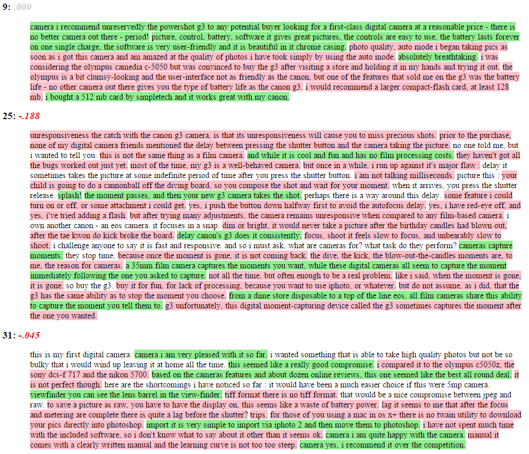

```{r, echo=FALSE}
desc <- suppressWarnings(readLines("DESCRIPTION"))
regex <- "(^Version:\\s+)(\\d+\\.\\d+\\.\\d+)"
loc <- grep(regex, desc)
ver <- gsub(regex, "\\2", desc[loc])
verbadge <- sprintf('<a href="https://img.shields.io/badge/Version-%s-orange.svg"></a></p>', ver, ver)
#verbadge <- ""
````

[](http://www.repostatus.org/#active)
[](https://travis-ci.org/trinker/stansent)
[](https://coveralls.io/r/trinker/stansent?branch=master)
`r verbadge`

```{r, echo=FALSE}
library(knitr)
knit_hooks$set(htmlcap = function(before, options, envir) {
  if(!before) {
    paste('<p class="caption"><b><em>',options$htmlcap,"</em></b></p>",sep="")
    }
    })
knitr::opts_knit$set(self.contained = TRUE, cache = FALSE)
knitr::opts_chunk$set(fig.path = "inst/figure/")
```

  

**stansent** wraps [Stanford's coreNLP sentiment tagger](http://nlp.stanford.edu/sentiment/) in a way that makes the process easier to get set up.  The output is designed to look and behave like the objects from the [**sentimentr**](https://github.com/trinker/sentimentr) package.  Plotting and the `sentimentr::highlight` functionality will work  similar to the `sentiment`/`sentiment_by` objects from **sentimentr**.  This requires less learning to work between the two packages.  

In addition to **sentimentr** and **stansent**, Matthew Jocker's has created the [**syuzhet** ](http://www.matthewjockers.net/2015/02/02/syuzhet/) package that utilizes dictionary lookups for the Bing, NRC, and Afinn methods.  Similarly, Subhasree Bose has contributed [RSentiment](https://CRAN.R-project.org/package=RSentiment) which utilizes dictionary lookup that atempts to address negation and sarcasm.  [Click here for a comparison](https://github.com/trinker/sentimentr#comparing-sentimentr-syuzhet-rsentiment-and-stanford) between **stansent**, **sentimentr**, **syuzhet**, and **RSentiment**.  Note the accuracy and run times of the packages.

# Installation

To download the development version of **stansent**:

Download the [zip ball](https://github.com/trinker/stansent/zipball/master) or [tar ball](https://github.com/trinker/stansent/tarball/master), decompress and run `R CMD INSTALL` on it, or use the **pacman** package to install the development version:

```r
if (!require("pacman")) install.packages("pacman")
pacman::p_load_gh(c("trinker/textshape", "trinker/stansent"))
```
After installing use the following to ensure Java and coreNLP are installed correctly:

```
check_setup()
```

to make sure your Java version is of the right version and [coreNLP](http://nlp.stanford.edu/software/corenlp.shtml) is set up in the right location.


# Usage

There are two main functions in **sentimentr** with a few helper functions.  The main functions, task category, & descriptions are summarized in the table below:


| Function                |  Function  |  Description                            |
|-------------------------|------------|-----------------------------------------|
| `sentiment_stanford`    | sentiment  | Sentiment at the sentence level         |
| `sentiment_stanford_by` | sentiment  | Aggregated sentiment by group(s)        |
| `uncombine`             | reshaping  | Extract sentence level sentiment from  `sentiment_by` |
| `get_sentences`         | reshaping  | Regex based string to sentence parser (or get sentences from `sentiment`/`sentiment_by`)|
| `check_setup`           | initial set-up |Make sure Java and coreNLP are set up correctly     |


# Contact

You are welcome to:
* submit suggestions and bug-reports at: <https://github.com/trinker/stansent/issues>
* send a pull request on: <https://github.com/trinker/stansent/>
* compose a friendly e-mail to: <tyler.rinker@gmail.com>

#Demonstration

## Load the Packages/Data

```{r, message=FALSE}
if (!require("pacman")) install.packages("pacman")
pacman::p_load_gh(c("trinker/stansent", "trinker/sentimentr"))
pacman::p_load(dplyr)

mytext <- c(
    'do you like it?  But I hate really bad dogs',
    'I am the best friend.',
    'Do you really like it?  I\'m not a fan'
)

data(presidential_debates_2012, cannon_reviews)
set.seed(100)
dat <- presidential_debates_2012[sample(1:nrow(presidential_debates_2012), 100), ]

```

## `sentiment_stanford`

```{r}
out1 <- sentiment_stanford(mytext) 
out1[["text"]] <- unlist(get_sentences(out1))
out1
```

## `sentiment_stanford_by`: Aggregation

To aggregate by element (column cell or vector element) use `sentiment_stanford_by` with `by = NULL`.

```{r}
out2 <- sentiment_stanford_by(mytext) 
out2[["text"]] <- mytext
out2
```

To aggregate by grouping variables use `sentiment_by` using the `by` argument.

```{r, echo=FALSE, results="hide"}
tic <- Sys.time()
out3 <- with(dat, sentiment_stanford_by(dialogue, list(person, time)))
toc <-  round(as.numeric(difftime(Sys.time(), tic, units = 'secs')), 1)
```


```{r, eval=FALSE}
(out3 <- with(dat, sentiment_stanford_by(dialogue, list(person, time))))
```

```{r, echo=FALSE}
out3
```

## Recycling

Note that the Stanford coreNLP functionality takes considerable time to compute (~`r toc` seconds to compute `out` above).  The output from `sentiment_stanford`/`sentiment_stanford_by` can be recycled inside of `sentiment_stanford_by`, reusing the raw scoring to save the new call to Java.


```{r}
with(dat, sentiment_stanford_by(out3, list(role, time)))
```

## Plotting 

### Plotting at Aggregated Sentiment

The possible sentiment values in the output are {`r paste(seq(-1, 1, by = .5), collapse = ", ")`}.  The raw number of occurrences as each sentiment level are plotted as a bubble version of [Cleveland's dot plot](https://en.wikipedia.org/wiki/Dot_plot_(statistics)).  The red cross represents the mean sentiment score (grouping variables are ordered by this by default).  The density is captured as a whiskerless boxplot.


```{r, warning=FALSE}
plot(out3)
```

### Plotting at the Sentence Level

The `plot` method for the class `sentiment` uses **syuzhet**'s `get_transformed_values` combined with **ggplot2** to make a reasonable, smoothed plot for the duration of the text based on percentage, allowing for comparison between plots of different texts.  This plot gives the overall shape of the text's sentiment.  The user can see `syuzhet::get_transformed_values` for more details.

```{r}
plot(uncombine(out3))
```


## Text Highlighting

The user may wish to see the output from `sentiment_stanford_by` line by line with positive/negative sentences highlighted.  The `sentimentr::highlight` function wraps a `sentiment_by` output to produces a highlighted HTML file (positive = green; negative = pink). Here we look at three random reviews from Hu and Liu's (2004) Cannon G3 Camera Amazon product reviews.  

```{r, eval=FALSE}
set.seed(2)
highlight(with(subset(cannon_reviews, number %in% sample(unique(number), 3)), sentiment_stanford_by(review, number)))
```




