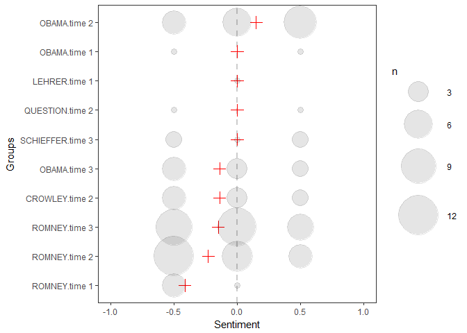
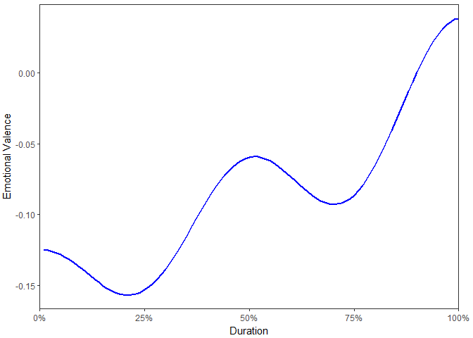

stansent   
============

**stansent** wraps [Stanford's coreNLP sentiment
tagger](http://nlp.stanford.edu/sentiment/) in a way that makes the
process easier to get set up. The output is designed to look and behave
like the objects from the
[**sentimentr**](https://github.com/trinker/sentimentr) package.
Plotting and the `sentimentr::highlight` functionality will work similar
to the `sentiment`/`sentiment_by` objects from **sentimentr**. This
requires less learning to work between the two packages.

In addition to **sentimentr** and **stansent**, Matthew Jocker's has
created the
[**syuzhet**](http://www.matthewjockers.net/2015/02/02/syuzhet/) package
that utilizes dictionary lookups for the Bing, NRC, and Afinn methods.
Similarly, Subhasree Bose has contributed
[RSentiment](https://CRAN.R-project.org/package=RSentiment) which
utilizes dictionary lookup that atempts to address negation and sarcasm.
[Click here for a
comparison](https://github.com/trinker/sentimentr#comparing-sentimentr-syuzhet-rsentiment-and-stanford)
between **stansent**, **sentimentr**, **syuzhet**, and **RSentiment**.
Note the accuracy and run times of the packages.

Installation
============

To download the development version of **stansent**:

Download the [zip
ball](https://github.com/trinker/stansent/zipball/master) or [tar
ball](https://github.com/trinker/stansent/tarball/master), decompress
and run `R CMD INSTALL` on it, or use the **pacman** package to install
the development version:

    if (!require("pacman")) install.packages("pacman")
    pacman::p_load_gh("trinker/coreNLPsetup", "trinker/stansent")

After installing use the following to ensure Java and coreNLP are
installed correctly:

    check_setup()

to make sure your Java version is of the right version and
[coreNLP](http://nlp.stanford.edu/software/corenlp.shtml) is set up in
the right location.

Table of Contents
============

-   [Installation](#installation)
-   [Functions](#functions)
-   [Contact](#contact)
-   [Demonstration](#demonstration)
    -   [Load the Packages/Data](#load-the-packagesdata)
    -   [`sentiment_stanford`](#sentiment_stanford)
    -   [`sentiment_stanford_by`: Aggregation](#sentiment_stanford_by-aggregation)
    -   [Recycling](#recycling)
    -   [Plotting](#plotting)
        -   [Plotting at Aggregated Sentiment](#plotting-at-aggregated-sentiment)
        -   [Plotting at the Sentence Level](#plotting-at-the-sentence-level)
    -   [Text Highlighting](#text-highlighting)

Functions
============

There are two main functions in **sentimentr** with a few helper
functions. The main functions, task category, & descriptions are
summarized in the table below:

<table>
<colgroup>
<col width="32%" />
<col width="16%" />
<col width="51%" />
</colgroup>
<thead>
<tr class="header">
<th>Function</th>
<th>Function</th>
<th>Description</th>
</tr>
</thead>
<tbody>
<tr class="odd">
<td><code>sentiment_stanford</code></td>
<td>sentiment</td>
<td>Sentiment at the sentence level</td>
</tr>
<tr class="even">
<td><code>sentiment_stanford_by</code></td>
<td>sentiment</td>
<td>Aggregated sentiment by group(s)</td>
</tr>
<tr class="odd">
<td><code>uncombine</code></td>
<td>reshaping</td>
<td>Extract sentence level sentiment from <code>sentiment_by</code></td>
</tr>
<tr class="even">
<td><code>get_sentences</code></td>
<td>reshaping</td>
<td>Regex based string to sentence parser (or get sentences from <code>sentiment</code>/<code>sentiment_by</code>)</td>
</tr>
<tr class="odd">
<td><code>highlight</code></td>
<td>Highlight positive/negative sentences as an HTML document</td>
<td></td>
</tr>
<tr class="even">
<td><code>check_setup</code></td>
<td>initial set-up</td>
<td>Make sure Java and coreNLP are set up correctly</td>
</tr>
</tbody>
</table>

Contact
=======

You are welcome to:    
- submit suggestions and bug-reports at: <https://github.com/trinker/stansent/issues>    
- send a pull request on: <https://github.com/trinker/stansent/>    
- compose a friendly e-mail to: <tyler.rinker@gmail.com>    

Demonstration
=============

Load the Packages/Data
----------------------

    if (!require("pacman")) install.packages("pacman")
    pacman::p_load_gh(c("trinker/stansent", "trinker/sentimentr"))
    pacman::p_load(dplyr)

    mytext <- c(
        'do you like it?  But I hate really bad dogs',
        'I am the best friend.',
        'Do you really like it?  I\'m not a fan'
    )

    data(presidential_debates_2012, cannon_reviews)
    set.seed(100)
    dat <- presidential_debates_2012[sample(1:nrow(presidential_debates_2012), 100), ]

`sentiment_stanford`
--------------------

    out1 <- sentiment_stanford(mytext) 
    out1[["text"]] <- unlist(get_sentences(out1))
    out1

    ##    element_id sentence_id word_count sentiment                       text
    ## 1:          1           1          4       0.0            do you like it?
    ## 2:          1           2          6      -0.5 But I hate really bad dogs
    ## 3:          2           1          5       0.5      I am the best friend.
    ## 4:          3           1          5       0.0     Do you really like it?
    ## 5:          3           2          4      -0.5              I'm not a fan

`sentiment_stanford_by`: Aggregation
------------------------------------

To aggregate by element (column cell or vector element) use
`sentiment_stanford_by` with `by = NULL`.

    out2 <- sentiment_stanford_by(mytext) 
    out2[["text"]] <- mytext
    out2

    ##    element_id word_count        sd ave_sentiment
    ## 1:          1         10 0.3535534         -0.25
    ## 2:          2          5        NA          0.50
    ## 3:          3          9 0.3535534         -0.25
    ##                                           text
    ## 1: do you like it?  But I hate really bad dogs
    ## 2:                       I am the best friend.
    ## 3:       Do you really like it?  I'm not a fan

To aggregate by grouping variables use `sentiment_by` using the `by`
argument.

    (out3 <- with(dat, sentiment_stanford_by(dialogue, list(person, time))))

    ##        person   time word_count        sd ave_sentiment
    ##  1:     OBAMA time 2        207 0.4042260     0.1493099
    ##  2:     OBAMA time 1         34 0.7071068     0.0000000
    ##  3:    LEHRER time 1          2        NA     0.0000000
    ##  4:  QUESTION time 2          7 0.7071068     0.0000000
    ##  5: SCHIEFFER time 3         47 0.5000000     0.0000000
    ##  6:     OBAMA time 3        129 0.4166667    -0.1393260
    ##  7:   CROWLEY time 2         72 0.4166667    -0.1393260
    ##  8:    ROMNEY time 3        321 0.3746794    -0.1508172
    ##  9:    ROMNEY time 2        323 0.3875534    -0.2293311
    ## 10:    ROMNEY time 1         95 0.2236068    -0.4138598

Recycling
---------

Note that the Stanford coreNLP functionality takes considerable time to
compute (~14.5 seconds to compute `out` above). The output from
`sentiment_stanford`/`sentiment_stanford_by` can be recycled inside of
`sentiment_stanford_by`, reusing the raw scoring to save the new call to
Java.

    with(dat, sentiment_stanford_by(out3, list(role, time)))

    ##         role   time word_count        sd ave_sentiment
    ## 1: candidate time 1        129 0.3933979   -0.29271628
    ## 2: candidate time 2        530 0.4154046   -0.06751165
    ## 3: candidate time 3        450 0.3796283   -0.15455530
    ## 4: moderator time 1          2        NA    0.00000000
    ## 5: moderator time 2         72 0.4166667   -0.13932602
    ## 6: moderator time 3         47 0.5000000    0.00000000
    ## 7:     other time 2          7 0.7071068    0.00000000

Plotting
--------

### Plotting at Aggregated Sentiment

The possible sentiment values in the output are {-1, -0.5, 0, 0.5, 1}.
The raw number of occurrences as each sentiment level are plotted as a
bubble version of [Cleveland's dot
plot](https://en.wikipedia.org/wiki/Dot_plot_(statistics)). The red
cross represents the mean sentiment score (grouping variables are
ordered by this by default). 

    plot(out3)

### Plotting at the Sentence Level

The `plot` method for the class `sentiment` uses **syuzhet**'s
`get_transformed_values` combined with **ggplot2** to make a reasonable,
smoothed plot for the duration of the text based on percentage, allowing
for comparison between plots of different texts. This plot gives the
overall shape of the text's sentiment. The user can see
`syuzhet::get_transformed_values` for more details.

    plot(uncombine(out3))

Text Highlighting
-----------------

The user may wish to see the output from `sentiment_stanford_by` line by
line with positive/negative sentences highlighted. The
`sentimentr::highlight` function wraps a `sentiment_by` output to
produces a highlighted HTML file (positive = green; negative = pink).
Here we look at three random reviews from Hu and Liu's (2004) Cannon G3
Camera Amazon product reviews.

    set.seed(2)
    highlight(with(subset(cannon_reviews, number %in% sample(unique(number), 3)), sentiment_stanford_by(review, number)))

