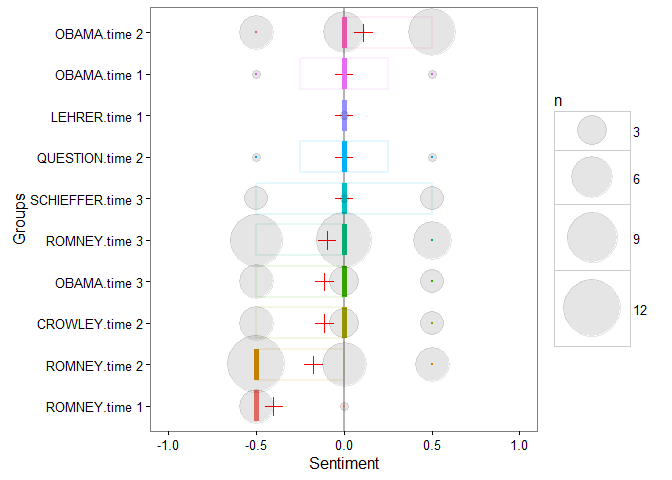
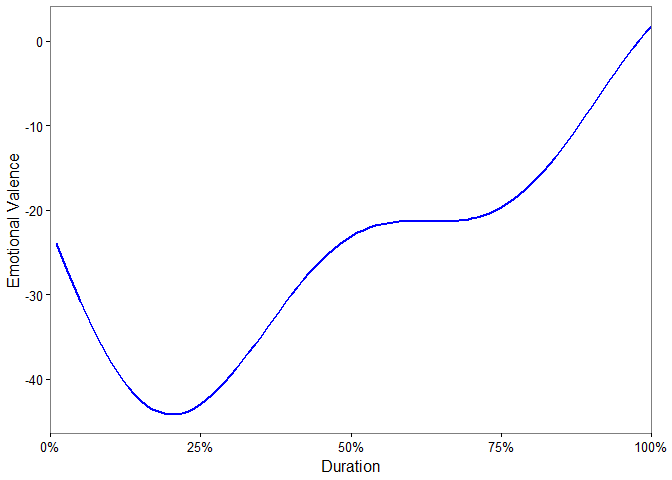

stansent
============

<tbody>
<tr class="odd">
<td align="left">title: &quot;stansent&quot;</td>
</tr>
<tr class="even">
<td align="left">date: &quot;31 December, 2015&quot;</td>
</tr>
<tr class="odd">
<td align="left">output:</td>
</tr>
<tr class="even">
<td align="left">md_document:</td>
</tr>
<tr class="odd">
<td align="left">toc: true</td>
</tr>
</tbody>
</table>

**stansent** wraps Stanford's sentiment tagger in a way that makes the
process easier to get set up. The output is designed to look and behave
like the objects from the
[**sentimentr**](https://github.com/trinker/sentimentr) package.
Plotting and the `sentimentr::highlight` functionality will work with
similar to the `sentiment`/`sentiment_by` objects from **sentimentr**.
This requires less learning to work between the two packages.

In addition the **sentimentr** and **stansent**, Matthew Jocker's has
created the
[**syuzhet**](http://www.matthewjockers.net/2015/02/02/syuzhet/) package
that utilizes dictionary lookups for the Bing, NRC, and Afinn methods.
[Click here for a
comparison](https://github.com/trinker/sentimentr#comparing-sentimentr-syuzhet-and-stanford)
between **stansent**, **sentimentr**, and **syuzhet**. Note the accuracy
and run times of the packages.

Table of Contents
============

<table>[<table>](#<table>)

Installation
============

To download the development version of **stansent**:

Download the [zip
ball](https://github.com/trinker/stansent/zipball/master) or [tar
ball](https://github.com/trinker/stansent/tarball/master), decompress
and run `R CMD INSTALL` on it, or use the **pacman** package to install
the development version:

    if (!require("pacman")) install.packages("pacman")
    pacman::p_load_gh("trinker/stansent")

After installing use the following to ensure Java and coreNLP are
installed correctly:

    check_setup()

to make sure your Java version is of the right version and
[coreNLP](http://nlp.stanford.edu/software/corenlp.shtml) is set up in
the right location.

Usage
=====

There are two main functions in **sentimentr** with a few helper
functions. The main functions, task category, & descriptions are
summarized in the table below:

<table>
<thead>
<tr class="header">
<th align="left">Function</th>
<th align="left">Function</th>
<th align="left">Description</th>
</tr>
</thead>
<tbody>
<tr class="odd">
<td align="left"><code>sentiment_stanford</code></td>
<td align="left">sentiment</td>
<td align="left">Sentiment at the sentence level</td>
</tr>
<tr class="even">
<td align="left"><code>sentiment_stanford_by</code></td>
<td align="left">sentiment</td>
<td align="left">Aggregated sentiment by group(s)</td>
</tr>
<tr class="odd">
<td align="left"><code>uncombine</code></td>
<td align="left">reshaping</td>
<td align="left">Extract sentence level sentiment from <code>sentiment_by</code></td>
</tr>
<tr class="even">
<td align="left"><code>get_sentences</code></td>
<td align="left">reshaping</td>
<td align="left">Regex based string to sentence parser (or get sentences from <code>sentiment</code>/<code>sentiment_by</code>)</td>
</tr>
<tr class="odd">
<td align="left"><code>check_setup</code></td>
<td align="left">initial set-up</td>
<td align="left">Make sure Java and coreNLP are set up correctly</td>
</tr>
</tbody>
</table>

Contact
=======

You are welcome to: 
* submit suggestions and bug-reports at: <https://github.com/trinker/stansent/issues> 
* send a pull request on: <https://github.com/trinker/stansent/> 
* compose a friendly e-mail to: <tyler.rinker@gmail.com>

Demonstration
=============

Load the Packages/Data
----------------------

    if (!require("pacman")) install.packages("pacman")
    pacman::p_load_gh(c("trinker/stansent", "trinker/sentimentr"))
    pacman::p_load(dplyr)

    mytext <- c(
        'do you like it?  But I hate really bad dogs',
        'I am the best friend.',
        'Do you really like it?  I\'m not a fan'
    )

    data(presidential_debates_2012)
    set.seed(100)
    dat <- presidential_debates_2012[sample(1:nrow(presidential_debates_2012), 100), ]

`sentiment_stanford`
--------------------

    out1 <- sentiment_stanford(mytext) 
    out1[["text"]] <- unlist(get_sentences(out1))
    out1

    ##    element_id sentence_id word_count sentiment                       text
    ## 1:          1           1          4       0.0            do you like it?
    ## 2:          1           2          6      -0.5 But I hate really bad dogs
    ## 3:          2           1          5       0.5      I am the best friend.
    ## 4:          3           1          5       0.0     Do you really like it?
    ## 5:          3           2          4      -0.5              I'm not a fan

`sentiment_stanford_by`: Aggregation
------------------------------------

To aggregate by element (column cell or vector element) use
`sentiment_stanford_by` with `by = NULL`.

    out2 <- sentiment_stanford_by(mytext) 
    out2[["text"]] <- mytext
    out2

    ##    element_id word_count        sd ave_sentiment
    ## 1:          1         10 0.3535534         -0.25
    ## 2:          2          5        NA          0.50
    ## 3:          3          9 0.3535534         -0.25
    ##                                           text
    ## 1: do you like it?  But I hate really bad dogs
    ## 2:                       I am the best friend.
    ## 3:       Do you really like it?  I'm not a fan

To aggregate by grouping variables use `sentiment_by` using the `by`
argument.

    (out3 <- with(dat, sentiment_stanford_by(dialogue, list(person, time))))

    ##        person   time word_count        sd ave_sentiment
    ##  1:     OBAMA time 2        207 0.4042260    0.11111111
    ##  2:     OBAMA time 1         34 0.7071068    0.00000000
    ##  3:    LEHRER time 1          2        NA    0.00000000
    ##  4:  QUESTION time 2          7 0.7071068    0.00000000
    ##  5: SCHIEFFER time 3         47 0.5000000    0.00000000
    ##  6:    ROMNEY time 3        321 0.3746794   -0.09615385
    ##  7:     OBAMA time 3        129 0.4166667   -0.11111111
    ##  8:   CROWLEY time 2         72 0.4166667   -0.11111111
    ##  9:    ROMNEY time 2        323 0.3875534   -0.17391304
    ## 10:    ROMNEY time 1         95 0.2236068   -0.40000000

Recycling
---------

Note that the Stanford coreNLP functionality takes considerable time to
compute (~15.7 seconds to compute `out` above). The output from
`sentiment_stanford`/`sentiment_stanford_by` can be recycled inside of
`sentiment_stanford_by`, reusing the raw scoring to save the new call to
Java.

    with(dat, sentiment_stanford_by(out3, list(role, time)))

    ##         role   time word_count        sd ave_sentiment
    ## 1: moderator time 1          2        NA    0.00000000
    ## 2: moderator time 3         47 0.5000000    0.00000000
    ## 3:     other time 2          7 0.7071068    0.00000000
    ## 4: candidate time 2        530 0.4154046   -0.04878049
    ## 5: candidate time 3        450 0.3796283   -0.10000000
    ## 6: moderator time 2         72 0.4166667   -0.11111111
    ## 7: candidate time 1        129 0.3933979   -0.28571429

Plotting
--------

### Plotting at Aggregated Sentiment

The possible sentiment values in the output are {-1, -0.5, 0, 0.5, 1}.
The raw number of occurrences as each sentiment level are plotted as a
bubble version of [Cleveland's dot
plot](https://en.wikipedia.org/wiki/Dot_plot_(statistics)). The red
cross represents the mean sentiment score (grouping variables are
ordered by this by default). The density is captured as a whiskerless
boxplot.

    plot(out3)

### Plotting at the Sentence Level

The `plot` method for the class `sentiment` uses **syuzhet**'s
`get_transformed_values` combined with **ggplot2** to make a reasonable,
smoothed plot for the duration of the text based on percentage, allowing
for comparison between plots of different texts. This plot gives the
overall shape of the text's sentiment. The user can see
`syuzhet::get_transformed_values` for more details.

    plot(uncombine(out3))

